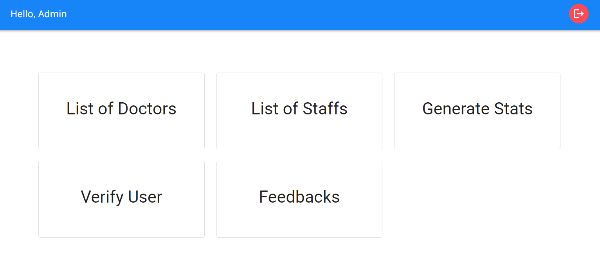
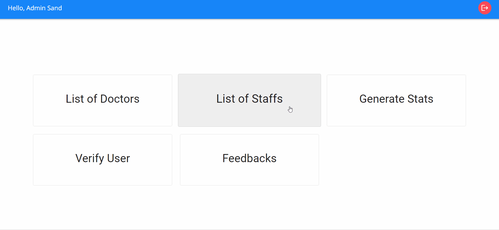
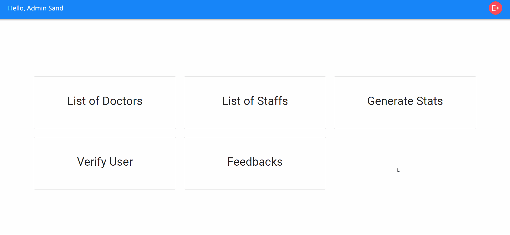
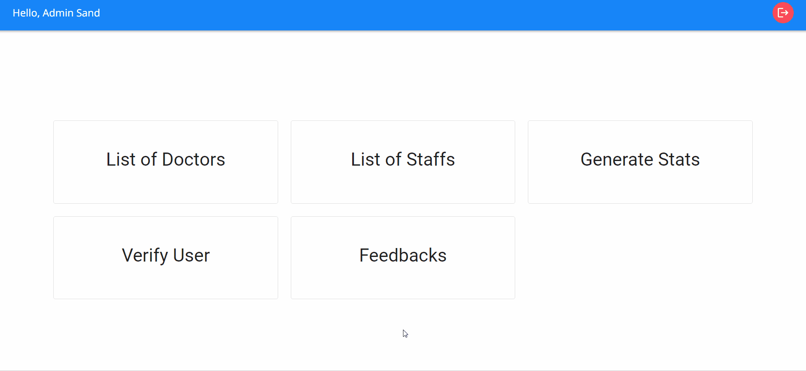

<h2 align="center">Admin Dashboard</h2>

### List of Doctors

Administrators can access an overview of all the verified doctors. This section empowers administrators to not only view the list but also edit doctor details. Additionally, administrators have the authority to update appointment fees as needed, allowing for flexibility in fee management over time.

### List of Staffs

Administrators can easily access a comprehensive list of all staff members. This section offers administrators the capability to not only view the staff roster but also edit their details. Moreover, administrators possess the authority to make necessary updates to staff-related information, ensuring accurate records and efficient management of the staff team.

### Generate Stats

Administrators can access essential system metrics at a glance. View data on top-rated doctors, verified doctors and staff, registered patients, and more. Make informed decisions and optimize system performance using valuable insights.

### Verify Users

Admins can efficiently manage staff and doctor accounts. Admins can either verify or reject the accounts of staff and doctors, ensuring a controlled access environment. Verified accounts grant staff and doctors login access to the system, reinforcing security measures and maintaining a trusted user base.

### Feedbacks

The "Feedbacks" tab centralizes all patient feedback for administrators to review. This consolidated view enables admins to access and assess feedback provided by patients in one convenient location, facilitating an efficient feedback analysis process.
