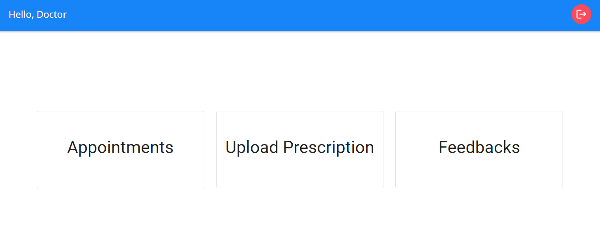
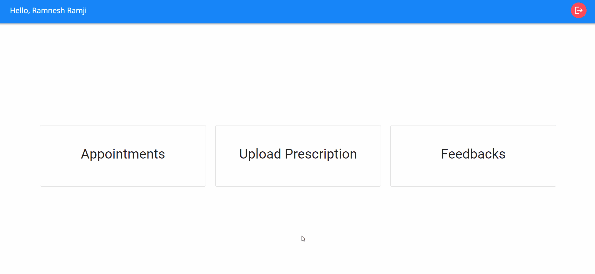

<h2 align="center">Staff Dashboard</h2>

### Appointments

Under the "Appointments" tab, doctors can effortlessly access a comprehensive overview of all upcoming appointments.

### Upload Prescription

Doctors have the capability to upload prescription files, which can be in the form of images or PDF documents. Once successfully uploaded, patients will be able to view these prescriptions in their dashboard.

### Feedbacks

On the "Feedbacks" tab, doctors can access the feedback provided by patients regarding their appointments with them. This section allows doctors to gain insights into patient experiences and sentiments.
