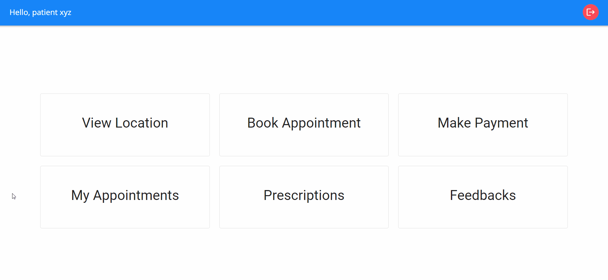
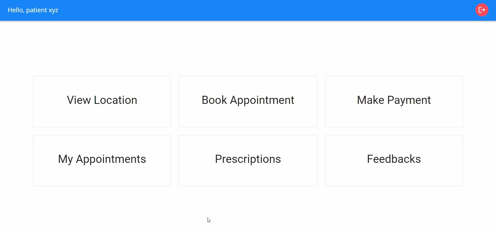

<h2 align="center">Patient Dashboard</h2>

### View Location

When patients click on the "View Location" tab on their dashboard, an interactive Google Map will open, displaying the precise location of the hospital. This feature helps patients easily find their way to the hospital and ensures a smooth navigation experience.

### Book Appointment

Patients can conveniently schedule appointments online through the system. Upon clicking the "Book Appointment" tab, a list of available doctors will be displayed. To further enhance user experience, patients have the option to filter doctors based on their respective departments. After selecting both the preferred appointment date and the desired department, the list of available doctors for that specific day and department will appear. Clicking the "BOOK" button will lead the user to the payment page. Once payment is successfully processed, the appointment is confirmed and will be visible under the "My Appointments" tab.

In instances where payment is not made during the booking process, patients have the flexibility to choose between two options. They can either make a self-payment before the appointment date by using the "Make Payment" tab, or opt for an offline payment by visiting the hospital and coordinating with the reception staff.

### Make Payment

Patients can settle any outstanding payments for appointments by simply clicking on the "Make Payment" tab. It's important to note that an appointment will be confirmed only upon successful payment.

### My Appointments

Patients can easily access their appointment details by clicking on the "My Appointments" tab. This section will display a comprehensive list of appointments, allowing patients to filter them based on their status: confirmed, pending, completed, or cancelled. Furthermore, patients will find an option to cancel appointments or make payment conveniently located on the same page.

### Prescriptions

Under the dedicated "Prescriptions" tab, patients can view any prescribed treatments or medications provided by the attending doctor during their appointments. The corresponding prescription files can be downloaded for future reference and convenience.

### Feedbacks

Patients have the opportunity to contribute feedback by writing reviews and providing ratings for any of their completed appointments. This feedback is valuable in assessing their experience. Additionally, patients can edit, update, or delete their feedback as needed, ensuring their input remains accurate and reflective of their evolving perspective.
