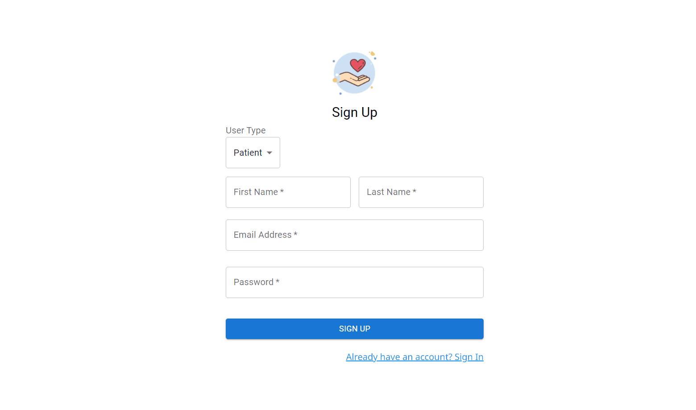
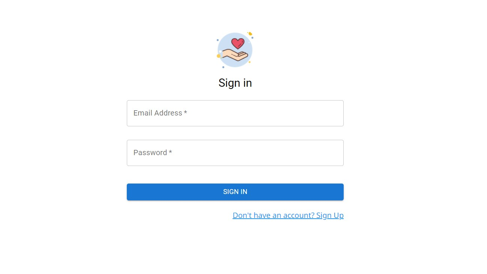
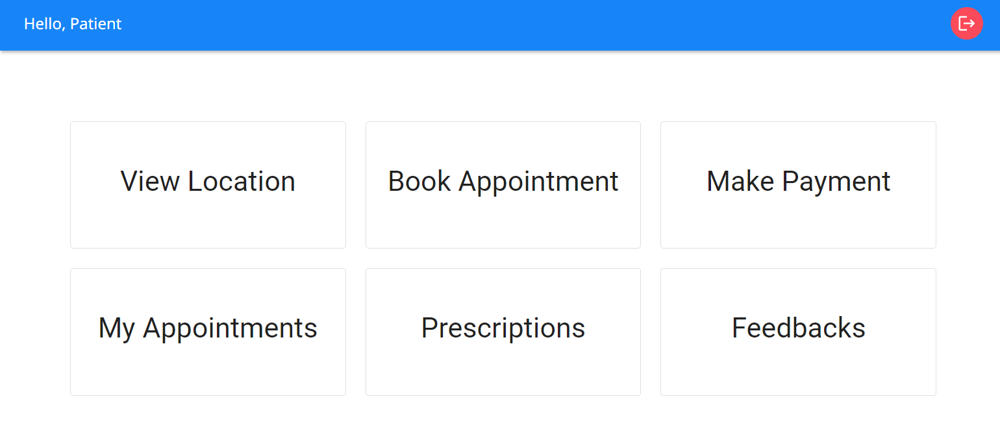

---

 

### Who will use this system

- Patients
- Reception Staffs
- Doctors
- Admin

 
 

### Login

To access the system and database, users must first register using a distinct email ID and password. This registration will serve as their login credentials. During registration, users should choose the appropriate user type and complete the signup form. Upon successful completion, users will be registered and automatically directed to the signin page.

Once registered, users can sign in using the provided email address and password. Upon successful sign in, users will be promptly taken to their respective dashboards, determined by their designated user type.

---

 
 

### Patient Dashboard

[See Detailed View](./PATIENT.md)

### Staff Dashboard

[See Detailed View](./STAFF.md)

### Doctor Dashboard

[See Detailed View](./DOCTOR.md)

### Admin Dashboard

[See Detailed View](./ADMIN.md)

---

 
 

### Tech Stack

     
     
     
     
      
     
     
     
     
     

  
---

 

### Prerequisites

This App uses NodeJS backend server for its functionality. First of all, setup the local server using the steps provided in the [medcare-server repo](https://github.com/SandeepKrSuman/medcare-server).

### Installation

- Step 1: Fork [this repo](https://github.com/SandeepKrSuman/medcare).
- Step 2: Clone your forked version of this repo locally. To clone, go to your command line / terminal, cd over to an appropriate directory and type in `git clone https://github.com/<your GitHub username>/medcare.git`.
- Step 3: `cd medcare`
- Step 4: While in the `medcare` directory, install the frontend dependencies using `npm install`.
- Step 5: Finally start the react app using `npm start`. The app will start on port `3000` which can be accessed through <http://localhost:3000/>.

---

   

If you like this project do show some love by giving this repo a 🌟.

  
 

### License

[MIT](LICENSE) © [SandeepKrSuman](https://github.com/SandeepKrSuman)
