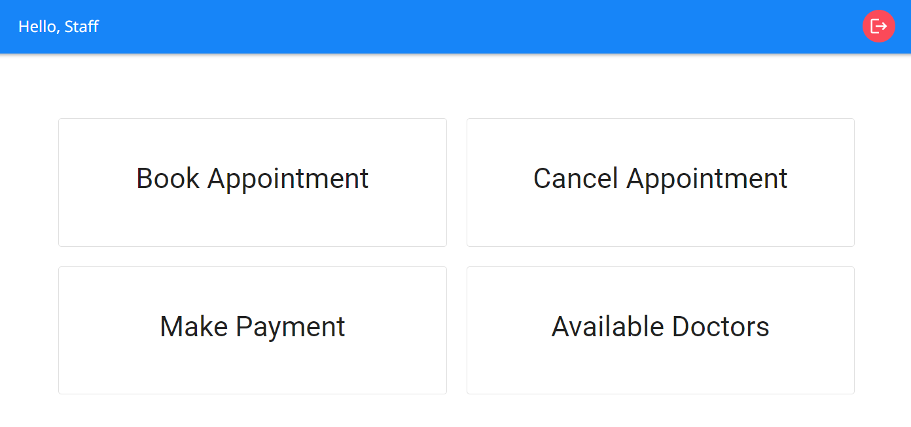
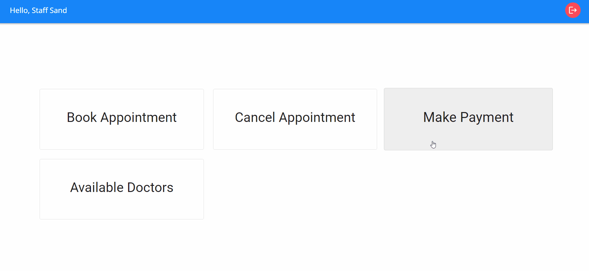
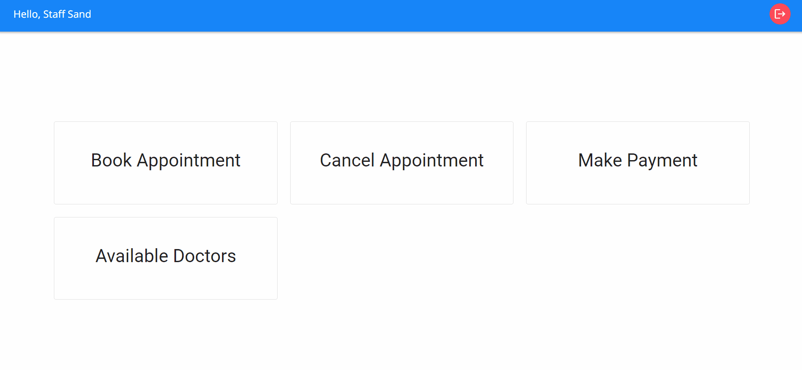

<h2 align="center">Staff Dashboard</h2>

### Book Appointment

For patients who prefer to visit the clinic in person, they have the option to request the reception staff to assist in booking appointments. In such cases, the staff will need to input the patient's registered email ID, which will serve as the basis for scheduling the appointment.

### Cancel Appointment

The staff has the capability on the patient's request to cancel appointments by entering the patient's email ID. Upon submission of the email ID, a list of all the cancellable appointments of the patient will be displayed. This allows the staff to efficiently manage and accommodate appointment cancellations based on the patient's preferences.

### Make Payment

Patients have the option to make offline payments by physically visiting the clinic. This approach provides a flexible payment solution that caters to those who prefer in-person transactions.

### Available Doctors

The "Available Doctors" tab within the Staff dashboard provides a vital resource for assisting patients with inquiries about doctor availability. By clicking on this tab, staff members gain access to a comprehensive list of doctors along with their respective working days. This feature equips the staff with up-to-date information, enabling them to effectively respond to patient queries about doctor availability.
